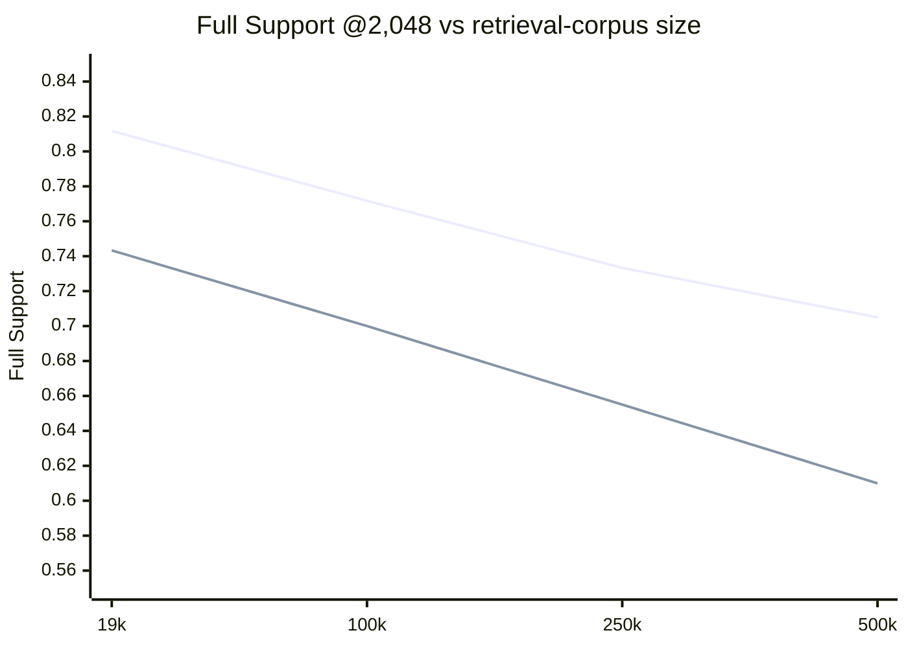

# Deviation 8.1 results — Dense scale sensitivity

> Deviation: [`8.1_dense_scale_sensitivity.md`](8.1_dense_scale_sensitivity.md) ·
> Implementation plan: [`8.1_implementation_plan.md`](8.1_implementation_plan.md) ·
> RunPod recipe: [`8.1_runpod_recipe.md`](8.1_runpod_recipe.md)
>
> This is a **dev-only** diagnostic. The 1,400 held-out questions were not opened, encoded or
> measured. Phase 8 remains closed at its dev gate.

---

## Result

**Terminal state: `STABLE_RANKING` (rule A).**

The relative BGE/Qwen ordering did not reverse or converge as the retrieval corpus grew from
19,366 to 500,000 paragraphs. BGE stayed ahead at every measured scale, and the Qwen-minus-BGE
deficit widened from **-41** to **-57 questions**.

Source: `data/phase8_1/outcome.json`.

| Retrieval corpus | BGE Full Support @2,048 | Qwen Full Support @2,048 | Qwen − BGE | Difference |
|---:|---:|---:|---:|---:|
| 19,366 | 487 / 600 = 0.8117 | 446 / 600 = 0.7433 | **-41** | -6.83 pp |
| 100,000 | 463 / 600 = 0.7717 | 420 / 600 = 0.7000 | **-43** | -7.17 pp |
| 250,000 | 440 / 600 = 0.7333 | 393 / 600 = 0.6550 | **-47** | -7.83 pp |
| 500,000 | 423 / 600 = 0.7050 | 366 / 600 = 0.6100 | **-57** | -9.50 pp |

Each model also degrades in absolute terms as distractors grow:

```text
BGE   C19 → C500: 487 → 423    drop 64 questions
Qwen  C19 → C500: 446 → 366    drop 80 questions
```

The floor guard is not close to firing: BGE retains **423 / 600** at C500 against the frozen
`244 / 600` floor. The convergence threshold was **20 questions**; the observed C500 deficit is
57. No crossover occurs at C100, C250 or C500.

The permitted interpretation written by the classifier is therefore exactly:

> No evidence was found up to 500k paragraphs that Qwen's Phase 8 deficit was an artefact of the
> 19k retrieval pool.

This does **not** establish which encoder is better at 5M paragraphs, that BGE is generally superior,
or that Entity Hop itself scales. It establishes only that the C19 BGE/Qwen ordering survives the
tested range.

---

## Full Support curve

Source: `data/phase8_1/scale-bge.json` and `data/phase8_1/scale-qwen.json`.

First line: BGE. Second line: Qwen.



---

## Recall@k

These are the fresh C500-prefix runs used by S6, not the historical Level-1 readings.

Source: `data/phase8_1/scale-bge.json`, `data/phase8_1/scale-qwen.json` and the run files they name.

| Model | Corpus | Recall@2 | Recall@5 | Recall@10 |
|---|---:|---:|---:|---:|
| BGE | 19,366 | 0.6767 | 0.8200 | 0.8683 |
| BGE | 100,000 | 0.6583 | 0.7975 | 0.8475 |
| BGE | 250,000 | 0.6500 | 0.7692 | 0.8242 |
| BGE | 500,000 | 0.6342 | 0.7475 | 0.8017 |
| Qwen | 19,366 | 0.6300 | 0.7658 | 0.8367 |
| Qwen | 100,000 | 0.6192 | 0.7442 | 0.8033 |
| Qwen | 250,000 | 0.6042 | 0.7250 | 0.7717 |
| Qwen | 500,000 | 0.5842 | 0.6975 | 0.7500 |

---

## Data gate

Source identity is in `data/phase8_1/source.json`.

```text
archive           enwiki-20171001-pages-meta-current-withlinks-abstracts.tar.bz2
source URL        https://nlp.stanford.edu/projects/hotpotqa/
page_checked      false
declared bytes    1,553,565,403
measured bytes    1,553,565,403
declared MD5      01edf64cd120ecc03a2745352779514c
measured MD5      01edf64cd120ecc03a2745352779514c
local SHA-256     1acca1c5cc93c4890ea51091d2bad7c3ef6987aead127ab88728dc9e26555729
bytes_agree       true
md5_agree         true
```

The byte size and MD5 above are the values carried into the deviation and checked against the staged
archive bytes. **The live HotpotQA page was not checked during S1** (`page_checked: false`); the
report does not upgrade that unperformed check into a claim. The local integrity record is SHA-256.

Reconciliation source: `data/phase8_1/reconciliation.json`.

```text
C19 units                    19,366
exact matches                19,142
normalized unique matches       219
ambiguous                          0
unmatched                          5
dev gold units                 1,194
dev gold matched               1,193
official paragraphs excluded       5
terminal_state                  null
mapping_digest  ac7cf0e661f2eb91fd24d5d5cd2629759ba4f1607068300b18120923eaf612ce
```

The five unresolved units are below the frozen ceiling of 50 and are handled by conservative title
exclusion. Residual limitation: that remedy removes same-title twins; a near-duplicate under a
different title remains outside its reach.

The nested selection was then frozen before scale retrieval:

```text
C19       19,366
C100     100,000
C250     250,000
C500     500,000
added distractors at C500: 480,634
ordering rule: sha256-salted-title-plaintext-v1
salt: 42
selection digest:
8fafcf707b63a2135be849dbdbc764b542ff0016feaf0f5ff5778d8596da3421
C19 digest:
f84719f95cad79874ac2a63696f87ebb4ef22cbc6b2fea6f4dc2b4115de9e7e9
```

Source: `data/phase8_1/selection.json`.

---

## Reproduction gate

### Level 1 — laptop, historical vectors

`data/phase8_1/reproduction.json` runs the new 8.1 evaluation path over the unchanged C19 corpus
using the historical caches.

```text
BGE   required 487 / 600    reproduced 487 / 600    exact
Qwen  required 446 / 600    reproduced 446 / 600    exact
terminal_state = null
```

Historical cache keys:

```text
BGE corpus    bacd74e7f468f0d4
BGE dev       35329d9e75da1d4f
Qwen corpus   66ef5c19a95f6cbe
Qwen dev      c9c589c29c226fb3
```

### D-L1 — measurement host, historical vectors

Before either fresh scale reading was interpreted, the same historical-vector check was repeated on
the measurement host.

```text
BGE   487 / 600    exact
Qwen  446 / 600    exact
```

Source: `scale-bge.json → level_2.level_one_on_measurement_host` and the corresponding Qwen field.

### Level 2 — C19 prefix of the fresh C500 encodes

```text
BGE   487 vs Level 1 487    difference 0
Qwen  446 vs Level 1 446    difference 0
tolerance                         ±1
```

Both are exact. Therefore **there is no Level-2 measurement caveat** on the scale figures.

---

## Model and measurement provenance

Both scale artifacts carry the same frozen dev question-set hash:

```text
question_set_hash = b0097f389a7cad04
top_k            = 100
seed             = 42
budget tokenizer = BAAI/bge-small-en-v1.5
```

### BGE

Source: `data/phase8_1/embedding-bge.json` and `scale-bge.json`.

```text
model                 BAAI/bge-small-en-v1.5
revision              5c38ec7c405ec4b44b94cc5a9bb96e735b38267a
resolved revision     5c38ec7c405ec4b44b94cc5a9bb96e735b38267a
weights SHA-256       3c9f31665447c8911517620762200d2245a2518d6e7208acc78cd9db317e21ad
dimension             384
query prompt          empty
max_seq_length        512
C500 corpus cache     8d81f4004079c381
dev query cache       35329d9e75da1d4f
embedding digest      6f6d76ed59d1d01be998ea93d86b7e3bd97ae151319bac8e0da837ef287423c0
```

### Qwen

The successful S6 run recorded this provenance in `scale-qwen.json`:

```text
model                 Qwen/Qwen3-Embedding-0.6B
revision              97b0c614be4d77ee51c0cef4e5f07c00f9eb65b3
resolved revision     97b0c614be4d77ee51c0cef4e5f07c00f9eb65b3
weights SHA-256       0437e45c94563b09e13cb7a64478fc406947a93cb34a7e05870fc8dcd48e23fd
dimension             1024
query prompt          Instruct: Given a web search query, retrieve relevant passages that answer the query\nQuery:
C500 corpus cache     d8e779f4a5dd5717
dev query cache       c9c589c29c226fb3
embedding digest      bfff014e869ca8128464ce4714643b9e80630cf530fbd2aec2373b9936683b41
```

### Measurement host

Both scale artifacts record:

```text
device        cuda
GPU           NVIDIA GeForce RTX 4090
CPU count     96
RAM           270,075,867,136 bytes
Python        3.12.3
torch         2.13.0+cu126
platform      Linux x86_64
```

---

## Retrieval cost and feasibility probe

Source: `scale-bge.json → retrieval_cost` and `scale-qwen.json → retrieval_cost`.

| Model | C500 mean seconds/query | C500 mean latency | Peak RSS | Frozen ceiling | Fallback |
|---|---:|---:|---:|---:|---|
| BGE | 0.068551 | 68.551 ms | 5,256.6 MiB | 1.0 s/query | not used |
| Qwen | 0.121931 | 121.931 ms | 9,513.6 MiB | 1.0 s/query | not used |

Both probes are comfortably below the frozen 1.0 s/query ceiling, so the declared blockwise exact
fallback was not implemented or used.

---

## Embedding cost and RunPod session cost

These are deliberately separate quantities.

### BGE attributable encoding cost

Source: `data/phase8_1/embedding-bge.json`.

```text
contracted rate            0.74 USD/hour
C500 embedding_seconds     234.13067620713264
paragraphs_per_second      2135.55954349893
600-question encode        0.9858195409178734 s
attributable embedding     0.04812686122035504 USD
```

### Qwen attributable encoding cost — unavailable

`embedding-qwen.json` was successfully written and loaded during S6 — otherwise the runner could not
have built the provenance that `scale-qwen.json` carries or proceeded to C19/C100/C250/C500 — but
the later RunPod output archive contained that file at **0 bytes**. The zero-byte copy is not treated
as valid provenance; the incident is recorded rather than fabricating a replacement artifact.

The preserved evidence is:

```text
original embedding digest
bfff014e869ca8128464ce4714643b9e80630cf530fbd2aec2373b9936683b41

RunPod output tar SHA-256
da908afdfe018f5e00c3be37b0285b3fd17b373a997928c60bfe62c570b798f5
```

The exact Qwen `embedding_seconds`, `question_seconds`, `max_seq_length`, bytes-on-disk block and
`embedding_usd` existed only in the lost embedding artifact and are therefore **not reported**.
They are not reconstructed from a progress bar or estimated after the fact.

### Total rented session

The exact RunPod billing total for the measurement session was:

```text
1.00 USD
```

This is the whole rental charge, including setup, model downloads, uploads and idle time. It is not
the sum of the per-model `embedding_usd` fields and no artifact was edited to reconcile the two.

---

## Run files and digest chain

Every scale reading records its own harness run file and digest.

| Model | Corpus | Run file | Run digest |
|---|---:|---|---|
| BGE | 19,366 | `run-dense-bge-c19-dev-20260921T200612+0000.json` | `31390109a5ffe6feba11b8493c2580ea98a9b85df58dc1b54ba89699d0c996e8` |
| BGE | 100,000 | `run-dense-bge-c100-dev-20260921T200617+0000.json` | `1da3757cdcaaf3a672637a761c9b9e66ca4d3986691797f332887d68f23713b6` |
| BGE | 250,000 | `run-dense-bge-c250-dev-20260921T200639+0000.json` | `0977e5256770bff898905912d3352d2e5f8b8ec753264c8e52cd8b4b5fd9a6b2` |
| BGE | 500,000 | `run-dense-bge-c500-dev-20260921T200720+0000.json` | `240a77294b7c2253b3121181520c8c06de76b93f460bc2df613feee4ccff5abf` |
| Qwen | 19,366 | `run-dense-qwen-c19-dev-20260921T203103+0000.json` | `1491f1488a02024125846f556e72872ad62993873ac681057ddd110d50f35f77` |
| Qwen | 100,000 | `run-dense-qwen-c100-dev-20260921T203124+0000.json` | `7ae4ec037ac5db0a714f8e46cc780808da90246491974c80dad26c7bb4c80f19` |
| Qwen | 250,000 | `run-dense-qwen-c250-dev-20260921T203206+0000.json` | `e5bc2a7333c15a8f80a000996404d9ab0a6c6d4e44f3f41e3a1028afd6a9612d` |
| Qwen | 500,000 | `run-dense-qwen-c500-dev-20260921T203319+0000.json` | `cdae8e61f324dfbb3e2155a8a55148f71fcf9fd5af0065c74765e46212103e72` |

The C500 unit-set hash is `4f080e8da14c4dec`; the C19 hash remains
`101f564fdcca620c`. Both models carry the same per-prefix hashes.

---

## Held-out status

Explicitly:

```text
held-out questions opened      NO
held-out questions encoded     NO
held-out questions measured    NO
number of held-out questions   1,400
```

Deviation 8.1 was never a second attempt at Phase 8's held-out gate. It is a bounded dev diagnostic.

---

## Validation and targeted security review

Final post-closeout validation, run after the GPU measurement and documentation corrections and
before commit:

```text
uv run pytest          2799 passed, 1 skipped in 183.02 s
uv run ruff check .    All checks passed
uv run mypy src        Success: no issues found in 61 source files
```

No source code changed during the GPU measurement or documentation closeout; this final pass
therefore validates the committed CPU implementation together with the completed closeout state.

The targeted review required by S7 is recorded in
[`../../security/audit-2026-09-22-deviation-8.1.md`](../../security/audit-2026-09-22-deviation-8.1.md)
and catalogued in [`../../security/README.md`](../../security/README.md). It raised **one Low
finding, SEC-033**, and no Critical, High or Medium finding. `probe_layout` applies the bounded
member read but does not enforce the separate per-line ceiling before its small schema probe calls
`json.loads`; the full record iterator does enforce that ceiling. This does not change any measured
8.1 result, but the loader should be corrected before it is reused for Phase 9.

---

## Propagation to Phase 9

`STABLE_RANKING` has the propagation fixed before measurement:

- **BGE-small becomes the task-validated primary Dense candidate for Phase 9.**
- The Phase 9 specification decides whether Qwen is retained as an external-comparability control.
- This does **not** retroactively make Phase 8 a success: Phase 8 remains stopped because its
  preregistered premise — Qwen being substantially stronger on C19 — failed.
- The broader question "does Entity Hop remain complementary beside a substantially stronger Dense
  retriever?" therefore remains open. Phase 9 now scales the best validated Dense candidate among
  the two tested encoders rather than claiming that a stronger Dense model was found.

Deviation 8.1 is closed.
